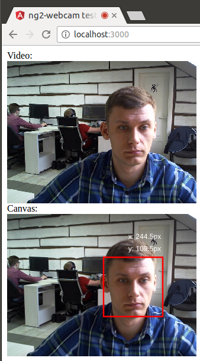

# Angular2 Face Detection Example


> Angular2 Face Detection Example

## Screenshot



## Notes

This example based on [ng2-webcam](https://www.npmjs.com/package/ng2-webcam) component and [tracking.js](https://trackingjs.com) library.


## Getting Started

In your HTML code just put following component:
```
<ng2-face-detector></ng2-face-detector>
```

And do not forget add declarations
```
declarations: [
  AppComponent,
  WebCamComponent,
  FaceDetectorComponent
]
```

## Try example
```
npm install
npm start
```


## References
* [Tracking.js](https://trackingjs.com/examples/face_camera.html)
* [ng2-webcam](https://www.npmjs.com/package/ng2-webcam)
* [MediaDevices](https://developer.mozilla.org/en-US/docs/Web/API/MediaDevices)
* [getUserMedia()](https://w3c.github.io/mediacapture-main/getusermedia.html)
* [WebRTC 1.0](http://w3c.github.io/webrtc-pc/)

## License
Copyright (c) 2016 archik
Licensed under the MIT license.
